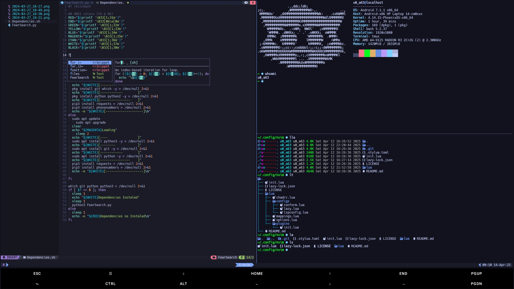
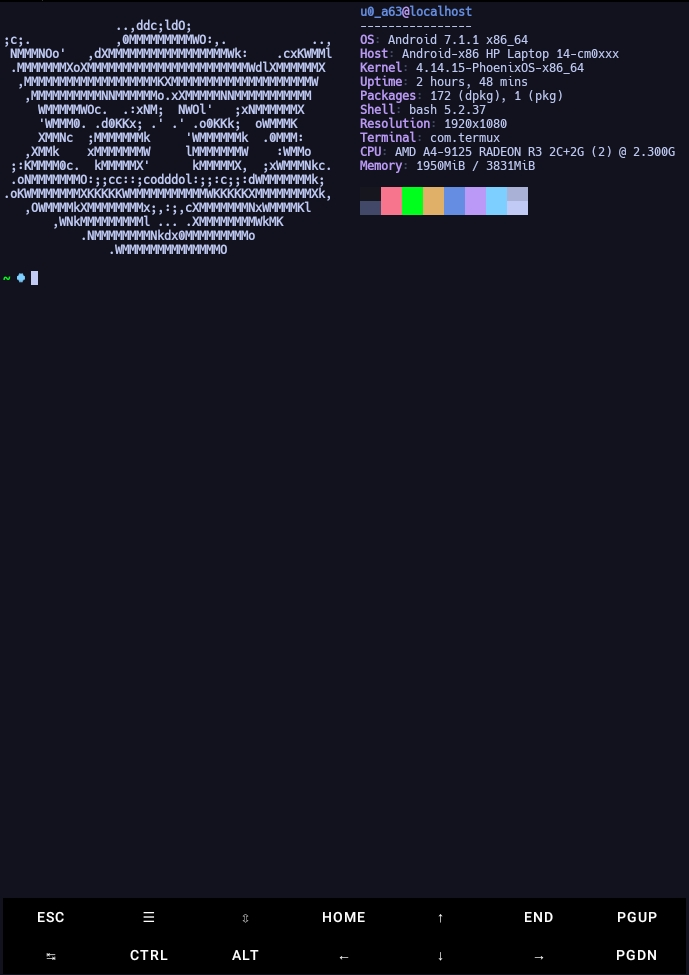

# Termux Dotfiles

Minimal dotfiles for Termux. Includes personal configurations for a better CLI experience.
I hope it helps you...

## Features

- Tokyo Night theme on Neovim (NvChad)
- `tmux` session support
- `lsd` for modern `ls` output
- `bat` as a `cat` replacement
- `neofetch` on shell startup
- Custom `bashrc`, `termux.properties`, fonts and color scheme

## Screenshots

### Horizontal



### Vertical



## Mappings
### Terminal with tmux
- `Ctrl + p` Open terminal Horizontalment
- `Ctrl + o` Open terminal verticalment
- `Ctrl + up, dow, rigth, left` Navegation
### Nvim
- `Ctrl + s` Saved
- `Ctrl + e` Exit
- `Ctrl + a` Search File
- `Space + t + h`


## Install

Clone the repo and run the install script:

```bash
git clone https://github.com/tuusuario/dotfiles.git
cd dotfiles
bash install.sh
```
# Contact
Feel free to reach me here:
https://beacons.ai/zumoxsx


# Happy Learning
